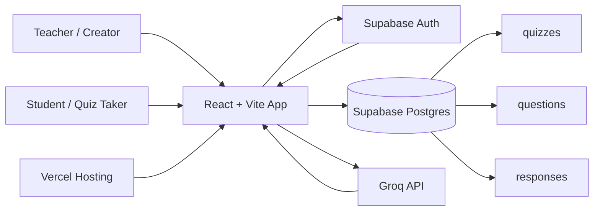

# 6ixQuest

6ixQuest is an AI-assisted quiz creation and assessment platform for educators, trainers, and teams. Creators can build quizzes manually or generate questions with Groq, share public quiz links, collect student responses, and review results from a protected dashboard.


## Live Deployment

- Live app: [https://6ix-quest.vercel.app](https://6ix-quest.vercel.app)
- Repository: [https://github.com/dhineshbuilder/6ixQuest](https://github.com/dhineshbuilder/6ixQuest)

## Screenshots

### Home


### Sign In


## Features

- AI quiz generation from a topic or study notes using Groq.
- Manual quiz builder with editable questions, options, correct answers, and ordering.
- Teacher authentication with email/password and Google sign-in through Supabase Auth.
- Protected creator dashboard for managing quizzes.
- Public quiz links that students can open without creating an account.
- Active/inactive quiz controls and optional valid-from / valid-until scheduling.
- Anti-cheating flow with fullscreen enforcement, tab-switch warnings, disabled copy/paste/right-click, and automatic submission after repeated violations.
- One-attempt response tracking using student identity fields.
- Automatic scoring and detailed response review.
- CSV export for quiz results.
- Responsive UI built with Tailwind CSS and Lucide icons.
- Vercel-ready SPA routing through `vercel.json`.

## Tech Stack

| Area | Technology |
| --- | --- |
| Frontend | React 18, TypeScript, Vite |
| Styling | Tailwind CSS |
| Routing | React Router |
| Icons | Lucide React |
| Backend services | Supabase Auth, Supabase Postgres, Row Level Security |
| AI generation | Groq API through `src/lib/groq.ts` |
| Deployment | Vercel |

## Architecture Overview



### Application Flow

1. A teacher signs in through Supabase Auth.
2. The teacher creates a quiz manually or generates quiz content with Groq.
3. Quiz metadata is stored in `quizzes`; questions are stored in `questions`.
4. The teacher shares a `/quiz/:id` link with students.
5. Students submit answers without logging in.
6. Responses and scores are stored in `responses`.
7. The teacher reviews analytics and exports results from the dashboard.

### Database Tables

| Table | Purpose |
| --- | --- |
| `quizzes` | Quiz title, description, creator, active status, and validity dates |
| `questions` | Question text, answer options, correct answer, and ordering |
| `responses` | Student details, selected answers, score, total questions, and submission time |

Row Level Security is enabled so authenticated creators can manage their own quizzes, while anonymous students can only read active quizzes/questions and insert responses.

## Project Structure

```text
.
+-- public/
|   +-- _redirects
|   +-- screenshots/
+-- src/
|   +-- components/
|   +-- contexts/
|   +-- lib/
|   |   +-- groq.ts
|   |   +-- supabase.ts
|   +-- pages/
|   +-- types/
+-- supabase/
|   +-- migrations/
+-- vercel.json
+-- netlify.toml
+-- vite.config.ts
+-- package.json
```

## Setup Instructions

### Prerequisites

- Node.js 18 or newer
- npm
- Supabase project
- Groq API key

### 1. Clone the repository

```bash
git clone https://github.com/dhineshbuilder/6ixQuest.git
cd 6ixQuest
```

### 2. Install dependencies

```bash
npm install
```

### 3. Create the environment file

Create `.env` in the project root:

```env
VITE_SUPABASE_URL=https://your-project.supabase.co
VITE_SUPABASE_ANON_KEY=your_supabase_anon_key

VITE_GROQ_API_KEY=your_groq_api_key
```

Important: variables prefixed with `VITE_` are exposed to the browser bundle. For a public production app, consider moving AI generation behind a server-side API route so your Groq key is not shipped to browsers.

### 4. Configure Supabase

Run the SQL migrations in `supabase/migrations`.

With Supabase CLI:

```bash
supabase link --project-ref YOUR_PROJECT_REF
supabase db push
```

Or copy each migration SQL file into the Supabase SQL Editor and run them in order.

For authentication:

- Enable email/password auth in Supabase if you want email login.
- Enable Google OAuth if you want Google sign-in.
- Add local and deployed URLs to Supabase Auth redirect URLs:
  - `http://localhost:5173`
  - `https://your-project.vercel.app`

### 5. Start the development server

```bash
npm run dev
```

Open:

```text
http://localhost:5173
```

### 6. Build for production

```bash
npm run build
```

Preview the production build:

```bash
npm run preview
```

## Vercel Deployment

This project includes `vercel.json` so Vercel builds Vite correctly and React Router routes work after refresh or direct visits.

```json
{
  "framework": "vite",
  "installCommand": "npm install",
  "buildCommand": "npm run build",
  "outputDirectory": "dist",
  "rewrites": [
    {
      "source": "/(.*)",
      "destination": "/index.html"
    }
  ]
}
```

Vercel settings:

| Setting | Value |
| --- | --- |
| Framework Preset | `Vite` |
| Install Command | `npm install` |
| Build Command | `npm run build` |
| Output Directory | `dist` |

Add these environment variables in Vercel:

```env
VITE_SUPABASE_URL=...
VITE_SUPABASE_ANON_KEY=...
VITE_GROQ_API_KEY=...
```

After deployment, add the Vercel URL to Supabase Auth redirect URLs.

If you deploy by drag and drop, drag the generated `dist` folder. For normal Git-based Vercel deployment, import the repository and let Vercel run `npm run build`.

### Optional Netlify Deployment

The existing `netlify.toml` and `public/_redirects` files are still present if you also want to deploy on Netlify.

## Available Scripts

| Command | Description |
| --- | --- |
| `npm run dev` | Start the local Vite development server |
| `npm run build` | Create a production build in `dist` |
| `npm run preview` | Preview the production build locally |
| `npm run lint` | Run ESLint |

## Environment Variables

| Variable | Required | Description |
| --- | --- | --- |
| `VITE_SUPABASE_URL` | Yes | Supabase project URL |
| `VITE_SUPABASE_ANON_KEY` | Yes | Supabase anonymous public key |
| `VITE_GROQ_API_KEY` | Yes | Groq API key used for AI quiz generation |

## Notes

- `.env` is ignored by git and should not be committed.
- `.env.example` documents the required variable names.
- Students can access quiz-taking routes without authentication.
- Teachers must be authenticated to create, edit, share, and review quizzes.
- The app currently calls Groq directly from the browser, which is convenient for a frontend-only deployment but not ideal for protecting production API keys.

## License

No license file is currently included. Add a `LICENSE` file before publishing if you want to define reuse permissions.
